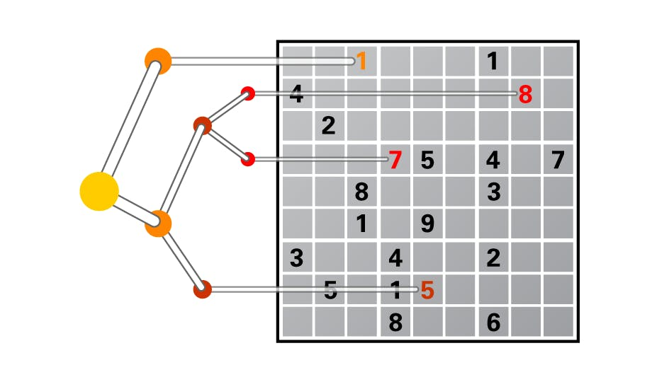

## Discrete Optimization

  
My solutions for the assignments of the Coursera course [Discrete Optimization](https://www.coursera.org/learn/discrete-optimization/home/info), all assignments are written in C++17 and Python.

 
 

### Content
| Assignment                            | Score |
| :------------------------------------ |:------|
| [Knapsack](knapsack)                  | 60/60 |
| [Graph Coloring](coloring)            | 60/60 |
| [Traveling Salesman](tsp)             | 60/60 |
| [Facility Location](facility)         | 80/80 |
| [Vehicle Routing](vehicle-routing)    | 60/60 |

 
 

### Visualization
#### Graph Coloring - 100 Nodes

 

#### Traveling Salesman - 574 Customers

 

#### Facility Location - 200 Facilities / 800 Customers

 

#### Vehicle Routing - 421 Customers / 41 Vehicles

