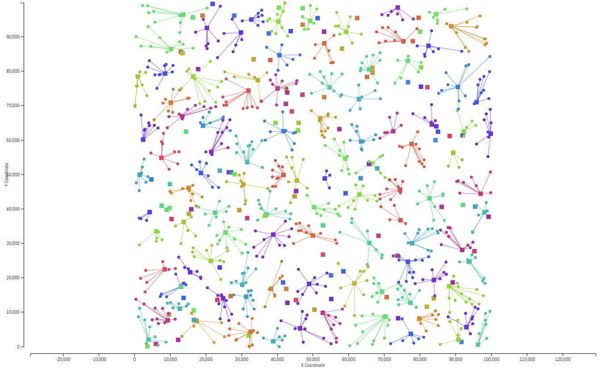

## Facility Location

Week 6 Assignment of the Coursera Course [Discrete Optimization](https://www.coursera.org/learn/discrete-optimization/home/info).  
This code can get full score **80/80** for the assignment.  

The implementation contains two parts: 

* A **Guided Local Search (GLS)** implemented in C++17.
* A following **Mixed Integer Programming (MIP)** refinement implemented with [Google OR-Tools](https://developers.google.com/optimization/).

The **GLS** part will generate an initial solution, then the **MIP** part will refine this initial solution.
For more information about **GLS**, please refer to `Guided Local Search - Fast Local Search.pdf`.  

### Usage

First, we need to compile the **GLS** part:  

`$ clang++ main.cpp -o main -std=c++17 -O2 -Wall`

This will generate executable file `main`, suppose you want to solve the problem in file `data/fl_200_7`, then you can run it this way:

`$ ./main data/fl_200_7`

This will generate an initial solution, which is stored in the file `cpp_output.txt`.  
For problem 1 ~ 3, the **GLS** solution is enough to get the full 10 points.  
For problem 4 ~ 8, a following **MIP** refinement is required.  
The general idea is to select a small fraction of facilities along with the customers they served.  
These facilities and customers form a sub-problem, which is small and can be solved by **MIP** efficiently.  
There are two ways to conduct this selection:

* Randomly select a facility and its nearest top N neighbor facilities.
* Randomly select N facilities that are in use (serve at least one customer) and randomly select M facilities that are not in use (serve no customer).

The first strategy is implemented in `mip-refine-nearest.py` and can handle problem 5 ~ 8 efficiently.
The second strategy is implemented in `mip-refine-random.py` and can handle problem 4 efficiently.

For `mip-refine-nearest.py`, you will need to tune the parameter N (which is the `n_sub_facilities` variable).  
For `mip-refine-random.py`, you will need to tune the parameter N and M  
(which is the `n_non_empty_sub_facilities` variable and the `n_empty_sub_facilities` variable).  

Before the refinement, we need to install [Google OR-Tools](https://developers.google.com/optimization/):  

`pip install or-tools`

Then, to refine the solution of problem `data/fl_200_7`, you can do it like this:

`$ python mip-refine-nearest.py data/fl_200_7`

The refined solution will be stored in the file `mip-output.txt`.

You can copy the content of `mip-output.txt` to the corresponding result file in folder `best-result/`, the `solver.py` will read result from this folder and submit it.

 
 

### Optimization Strategy

* Guided Local Search
* Mixed Integer Programming

 
 

### Visualization
#### Facility Location - 200 Facilities / 800 Customers
