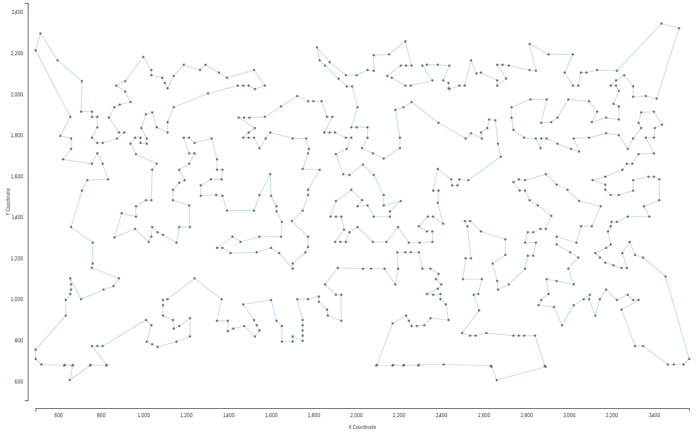

## Traveling Salesman

Week 4 Assignment of the Coursera Course [Discrete Optimization](https://www.coursera.org/learn/discrete-optimization/home/info).  
This code can get full score **60/60** for the assignment.  
The implementation is written in C++17. To run the program you need to compile `main.cpp`, here I use clang as my compiler:

`$ clang++ main.cpp -o main -std=c++17 -O2 -Wall`

This will generate executable file `main`, then if you want to solve problem `tsp_51_1` you can type:

`$ ./main data/tsp_51_1`

The solution will be written to `cpp_output.txt`, you can copy its content to the corresponding file in folder `best-result`.

To submit, simply type:

`$ python submit.py`

`submit.py` will read result from folder `best-result`.

 
 

### Optimization Strategy

* 2-opt
* Guided Local Search
* Fast Local Search

 
 

### Visualization
#### Traveling Salesman - 574 Customers
